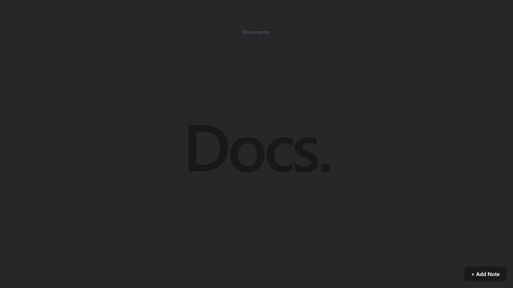
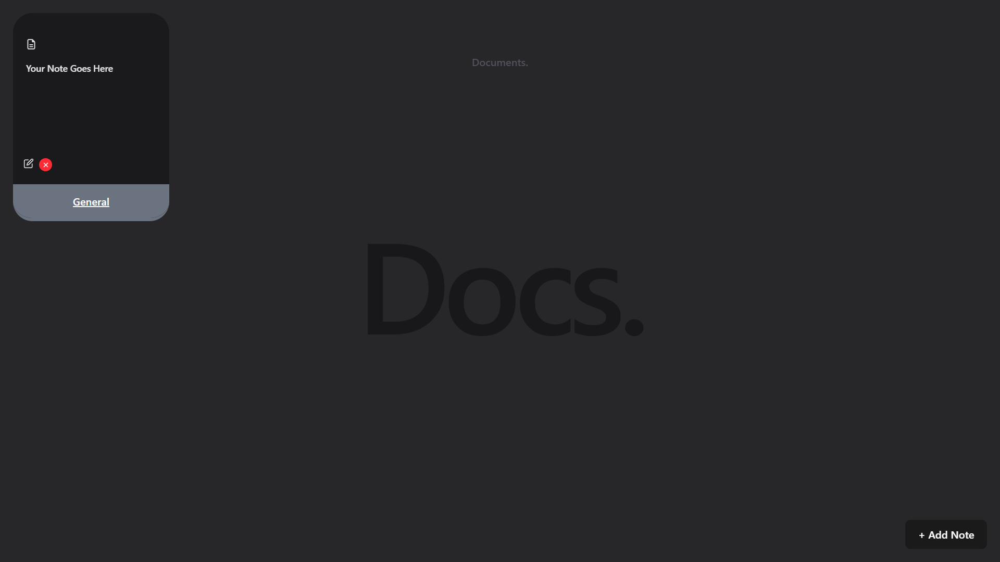

# 📝 Notes App

### _A Beautiful & Feature-Packed Notes Application Built with React & Tailwind CSS_

<p align="center">
  
  
</p>

---

## 🚀 Introduction

Welcome to **Notes App**, a simple yet **powerful** note-taking application designed with **modern UI** and **effortless usability** in mind.  
This app is built using **React** and **Tailwind CSS**, offering a **minimalist yet scalable** foundation for adding advanced features.

🔸 **Current State** → Static Notes Display  
🔹 **Future Plan** → Full CRUD Functionality + Firebase + Animations & More!

---

## ✨ Features

### ✅ **Current Features:**

✔️ **Sleek UI** with Tailwind CSS  
✔️ **Card-Based Notes Layout**  
✔️ **Customizable Tag System** (Colors, Status)  
✔️ **Optimized for Performance**

### 🚀 **Upcoming Features:**

🔹 **CRUD Operations** - Add, Edit & Delete Notes ✏️  
🔹 **Save Notes to LocalStorage** for Persistence 📂  
🔹 **Drag & Drop Notes** for Easy Organization 🖱️  
🔹 **Pin Important Notes** for Quick Access 📌  
🔹 **Smooth Animations (Framer Motion)** 🎭  
🔹 **Mobile-Responsive Design** 📱  
🔹 **Floating Action Button** for Quick Actions ⚡  
🔹 **Firebase / Supabase Integration** 🔥  
🔹 **Login & Signup (Firebase Auth/Auth0)** 🔑  
🔹 **Markdown Support for Rich Text** 📝  
🔹 **Export Notes as PDF/Text** 📜  
🔹 **Voice-to-Text for Quick Note-Taking** 🎙️  
🔹 **Reminders & Deadlines for Notes** ⏰  
🔹 **Progress Tracker for Task Completion** 📊  
🔹 **Theme Customization (Dark/Light Mode)** 🌗

---

## 🛠️ Tech Stack

| **Technology**       | **Purpose**             |
| -------------------- | ----------------------- |
| **React.js** ⚛️      | Frontend Development    |
| **Tailwind CSS** 🎨  | Styling & UI Design     |
| **useState Hook** 🌀 | State Management        |
| **React Icons** 🎭   | Icons & UI Enhancements |
| **Framer Motion** 🎬 | (Planned) Animations    |

---

## 📦 Installation & Setup

### 🔹 Clone the Repository

```sh
git clone https://github.com/Shivansh-04/Docs_React.git
cd docs
```

### 🔹 Install Dependencies

```sh
npm install
```

### 🔹 Start the Development Server

```sh
npm run dev
```

🔹 Open **`http://localhost:5173`** to view the app in the browser.

---

## 📸 Screenshots

_(💡 Soon!)_

---

## 🤝 Contributing

If you have ideas 💡, find bugs 🐛, or want to improve the project, feel free to **open an issue** or **submit a pull request**.  
Any contributions are **highly appreciated**! 🚀

---

## 📜 License

This project is **open-source** under the **MIT License**.

---

### 🌟 Support & Feedback

If you love this project, don't forget to **⭐ Star the repository** on GitHub! 🚀

💬 **Feedback?** Open an issue or reach out to me!
